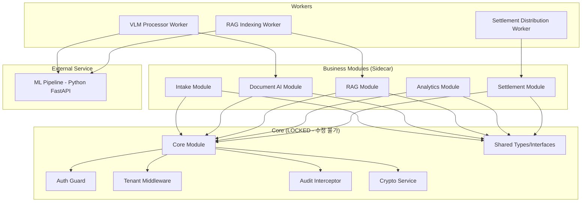

# SueTogether Platform — 아키텍처 설계서

> SMA Protocol Phase 2 산출물

---

## 1. 아키텍처 개요

**Modular Monolith → Microservices** 전략을 채택합니다.
초기에는 NestJS 모듈러 모노리스로 빠르게 구축하고,
트래픽 증가에 따라 각 모듈을 독립 마이크로서비스로 분리합니다.

## 2. 모듈 의존성 다이어그램



## 3. 폴더 구조

```
suetogether-platform/
├── apps/
│   ├── web/                    # Next.js 15 프론트엔드
│   │   ├── app/                # App Router 페이지
│   │   │   ├── (auth)/         # 로그인/회원가입
│   │   │   ├── (dashboard)/    # 인증된 사용자 대시보드
│   │   │   │   ├── intake/     # 인테이크 챗봇
│   │   │   │   ├── cases/      # 사건 관리
│   │   │   │   ├── evidence/   # 증거 관리
│   │   │   │   ├── analytics/  # 분석 대시보드
│   │   │   │   ├── settlement/ # 합의금 관리
│   │   │   │   └── admin/      # 관리자 설정
│   │   │   └── layout.tsx
│   │   ├── components/         # 공유 UI 컴포넌트
│   │   └── lib/                # API 클라이언트, 유틸
│   └── api/                    # NestJS API 서버
│       ├── src/
│       │   ├── core/           # ★ CORE (LOCKED)
│       │   │   ├── auth/       # JWT + RBAC
│       │   │   │   ├── auth.guard.ts
│       │   │   │   ├── auth.service.ts
│       │   │   │   ├── auth.controller.ts
│       │   │   │   └── auth.module.ts
│       │   │   ├── tenant/     # 멀티테넌트
│       │   │   │   ├── tenant.guard.ts
│       │   │   │   ├── tenant.middleware.ts
│       │   │   │   └── tenant.module.ts
│       │   │   ├── audit/      # 감사로그
│       │   │   │   ├── audit.interceptor.ts
│       │   │   │   ├── audit.service.ts
│       │   │   │   └── audit.module.ts
│       │   │   ├── crypto/     # PII 암호화
│       │   │   │   ├── crypto.service.ts
│       │   │   │   └── crypto.module.ts
│       │   │   └── core.module.ts
│       │   ├── shared/         # ★ SHARED TYPES (LOCKED)
│       │   │   ├── interfaces/ # 서비스 인터페이스
│       │   │   ├── dto/        # 데이터 전송 객체
│       │   │   ├── enums/      # 공유 열거형
│       │   │   └── types/      # 공유 타입
│       │   ├── modules/
│       │   │   ├── intake/
│       │   │   │   ├── intake.controller.ts
│       │   │   │   ├── intake.service.ts
│       │   │   │   ├── intake.module.ts
│       │   │   │   └── dto/
│       │   │   ├── document-ai/
│       │   │   │   ├── document-ai.controller.ts
│       │   │   │   ├── document-ai.service.ts
│       │   │   │   ├── document-ai.module.ts
│       │   │   │   ├── vlm-client.service.ts
│       │   │   │   ├── cross-validation.service.ts
│       │   │   │   └── dto/
│       │   │   ├── rag/
│       │   │   │   ├── rag.controller.ts
│       │   │   │   ├── rag.service.ts
│       │   │   │   ├── rag.module.ts
│       │   │   │   ├── medical-chronology.service.ts
│       │   │   │   └── dto/
│       │   │   ├── analytics/
│       │   │   │   ├── analytics.controller.ts
│       │   │   │   ├── analytics.service.ts
│       │   │   │   ├── analytics.module.ts
│       │   │   │   ├── prediction.service.ts
│       │   │   │   ├── gis.service.ts
│       │   │   │   └── dto/
│       │   │   └── settlement/
│       │   │       ├── settlement.controller.ts
│       │   │       ├── settlement.service.ts
│       │   │       ├── settlement.module.ts
│       │   │       ├── firmbanking-client.service.ts
│       │   │       ├── payment-gateway.service.ts
│       │   │       └── dto/
│       │   ├── workers/
│       │   │   ├── vlm-processor.worker.ts
│       │   │   ├── settlement-distribution.worker.ts
│       │   │   └── rag-indexing.worker.ts
│       │   ├── app.module.ts
│       │   └── main.ts
│       ├── prisma/
│       │   └── schema.prisma
│       ├── test/
│       └── nest-cli.json
├── services/
│   └── ml-pipeline/            # Python FastAPI
│       ├── app/
│       │   ├── main.py
│       │   ├── vlm/
│       │   │   ├── router.py
│       │   │   ├── layoutlm_service.py
│       │   │   └── donut_service.py
│       │   ├── rag/
│       │   │   ├── router.py
│       │   │   ├── embeddings.py
│       │   │   └── retriever.py
│       │   └── config.py
│       ├── requirements.txt
│       └── Dockerfile
├── docs/
│   ├── requirements.md
│   └── architecture.md
├── docker-compose.yml
├── turbo.json
├── package.json
├── .gitignore
└── README.md
```

## 4. Core Lock 선언

다음 파일/폴더는 **메인 에이전트만 수정 가능**합니다.
Jules 서브 에이전트는 **읽기만 가능**합니다.

| 경로 | 설명 |
|------|------|
| `apps/api/src/core/**` | Core 모듈 전체 |
| `apps/api/src/shared/**` | 공유 타입/인터페이스 |
| `apps/api/prisma/**` | Prisma 스키마 |
| `apps/api/src/app.module.ts` | 루트 모듈 |
| `apps/api/src/main.ts` | 엔트리포인트 |
| `turbo.json` | Turborepo 설정 |
| `package.json` (루트) | 루트 패키지 설정 |
| `docker-compose.yml` | 도커 설정 |

## 5. 서브 에이전트 파일 소유권

| 에이전트 ID | 소유 폴더 | 제한 사항 |
|-------------|-----------|----------|
| st-p2-intake | `apps/api/src/modules/intake/**` | Core/Shared 읽기만 |
| st-p2-docai | `apps/api/src/modules/document-ai/**`, `apps/api/src/workers/vlm-processor.worker.ts` | Core/Shared 읽기만 |
| st-p2-rag | `apps/api/src/modules/rag/**`, `apps/api/src/workers/rag-indexing.worker.ts` | Core/Shared 읽기만 |
| st-p2-analytics | `apps/api/src/modules/analytics/**` | Core/Shared 읽기만 |
| st-p2-settlement | `apps/api/src/modules/settlement/**`, `apps/api/src/workers/settlement-distribution.worker.ts` | Core/Shared 읽기만 |
| st-p2-mlpipeline | `services/ml-pipeline/**` | NestJS 코드 수정 불가 |

## 6. Inter-Module Communication Contracts

모든 모듈 간 통신은 `shared/interfaces/`에 정의된 인터페이스를 통해서만 이루어집니다.

```typescript
// shared/interfaces/document-ai.interface.ts
export interface IDocumentAIService {
  processDocument(input: ProcessDocumentInput): Promise<ProcessDocumentOutput>;
  getVLMResult(evidenceId: string): Promise<VLMResult | null>;
  crossValidate(input: CrossValidateInput): Promise<CrossValidationResult>;
}

// shared/interfaces/settlement.interface.ts
export interface ISettlementService {
  calculateDistribution(settlementId: string): Promise<DistributionResult>;
  executeBatchTransfer(settlementId: string): Promise<BatchTransferResult>;
  getTransferStatus(distributionId: string): Promise<TransferStatusResult>;
}

// shared/interfaces/rag.interface.ts
export interface IRAGService {
  indexDocuments(caseId: string, evidenceIds: string[]): Promise<IndexResult>;
  query(caseId: string, question: string): Promise<RAGQueryResult>;
  generateMedicalChronology(caseId: string, plaintiffId: string): Promise<MedicalChronologyResult>;
}
```
